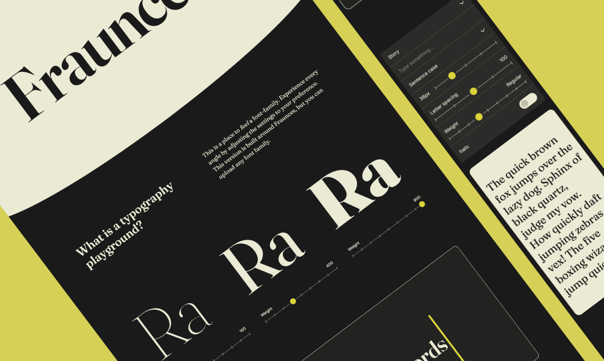

# Typography Playground

Een interactieve showcase voor het variabele lettertype [Fraunces](https://fraunces.undercase.xyz/), gebouwd met Next.js en Tailwind CSS. Het is een plek om een lettertypefamilie te _voelen_ in plaats van er alleen over te lezen. Elke sectie laat je een as van het lettertype aanpassen en het resultaat direct zien.

Live: [typography-playground-nine.vercel.app](https://typography-playground-nine.vercel.app/)



## Wat het doet

De pagina is één doorlopende scrollflow van secties (`app/page.tsx`):

- **Nav** — sticky header met ankerlinks naar de secties Family, Weights en Playground
- **Hero (Family)** — een grote weergave van "Fraunces" ter introductie van het lettertype
- **Explanation** — korte introductietekst die het doel van de playground omschrijft
- **Weights** — drie `WeightCard`s (beginnend bij 100, 400 en 900), elk met een eigen schuif-regelaar, waarmee je het lettergewicht naast elkaar kunt vergelijken op hetzelfde "Ra"-voorbeeld, in real time
- **Playground** — een groot `contentEditable` tekstveld waarin je vrij kunt typen en het resultaat op weergaveformaat in Fraunces ziet
- **Custom** — het belangrijkste experimenteerpaneel:
  - Kies tussen een **Story** (pangram) of **Alphabet** voorbeeld, of typ je eigen tekst
  - Wissel van tekstcasing: Sentence case, HOOFDLETTERS, kleine letters, Title case
  - Regel **lettergrootte**, **letterspatiëring**, **gewicht** (100–900 via variabele lettertype-assen) en een **cursief**-schakelaar
  - Zie alle aanpassingen live toegepast op de voorbeeld tekst in de `Result`-preview
- **Footer** — credits.

De stijl van het lettertype wordt aangestuurd via CSS variable-font-assen (`SOFT`, `WONK`), gedefinieerd in `app/lib/constants.ts` en toegepast via inline `fontVariationSettings`, gecombineerd met standaard `font-weight`/`font-style`/`letter-spacing` voor de aanpasbare eigenschappen.

## Tech stack

- [Next.js 16](https://nextjs.org) (App Router)
- [React 19](https://react.dev)
- [Tailwind CSS v4](https://tailwindcss.com)
- [Radix UI](https://www.radix-ui.com/) — `Select`- en `Switch`-primitieven voor de filter-/aanpassingsregelaars
- [Lucide](https://lucide.dev/) — iconen
- TypeScript
- Fraunces & Inter geladen via `next/font/google`

## Projectstructuur

```
app/
├── layout.tsx              # Root layout, fonts, metadata
├── page.tsx                # Zet alle secties in volgorde samen
├── globals.css             # Tailwind + globale stijlen
├── lib/
│   └── constants.ts         # Gedeelde font-variation-settings (FV)
└── components/
    ├── nav.tsx               # Sticky header / anker-nav
    ├── hero.tsx              # "Family"-sectie
    ├── explanation.tsx       # Introductietekst
    ├── weight.tsx             # "Weights"-sectie (WeightCard x3)
    ├── playground.tsx        # ContentEditable "Playground"-sectie
    ├── custom.tsx             # "Custom"-paneel: state + layout-koppeling
    ├── result.tsx             # Live preview van de aangepaste tekst
    ├── footer.tsx             # Footer
    ├── filtering/            # Regelaars die bepalen *welke* tekst wordt getoond
    │   ├── story.tsx           # Story / Alphabet select
    │   ├── typesomething.tsx   # Vrije-tekstinvoer
    │   ├── casetype.tsx        # Tekstcasing-select
    │   └── fontsize.tsx        # Lettergrootte-slider
    └── adjustments/          # Regelaars die bepalen *hoe* de tekst eruitziet
        ├── width.tsx           # Letter spatiëring-slider
        ├── weight.tsx           # Gewicht-slider
        └── italic.tsx          # Cursief-schakelaar
```

## Aan de slag

```bash
npm install
npm run dev
```

Open [http://localhost:3000](http://localhost:3000).

## Scripts

| Command         | Omschrijving          |
| --------------- | --------------------- |
| `npm run dev`   | Start dev-server      |
| `npm run build` | Productie-build       |
| `npm run start` | Start productieserver |
| `npm run lint`  | Voer ESLint uit       |
